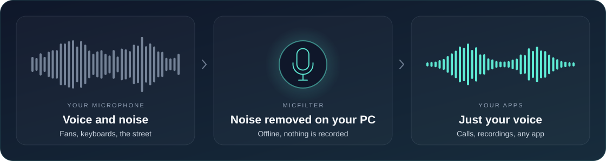
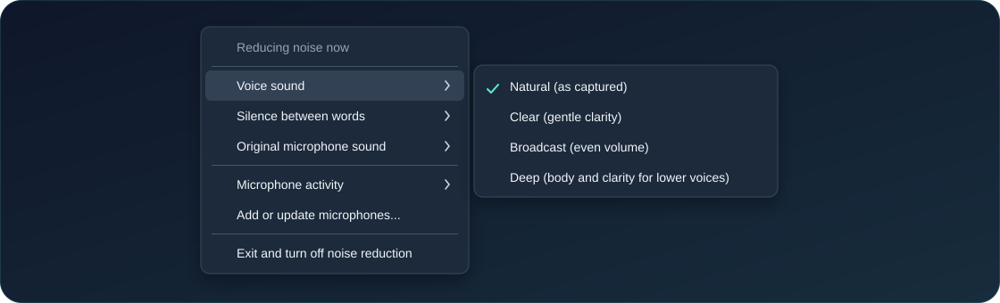

**Your voice, without the background noise.** 
MicFilter cleans up your microphone for your calls and recordings. 
It runs on your PC, works offline and never saves your voice.

[How it works](#how-it-works) · [Install](#install) · [Controls](#everyday-controls) · [Contributing](CONTRIBUTING.md)

## How it works

MicFilter installs as a Windows audio effect on the microphones you choose.
Apps that use those microphones get the cleaned sound automatically — there is
nothing to set up inside each app. Your choice stays saved after restarting
Windows.

## Install

1. **[Download MicFilter-Setup.exe](https://github.com/dean6609/mic-filter/releases/latest/download/MicFilter-Setup.exe)**, open it and accept the administrator prompt.
2. **Pick your microphones.** With just one, setup continues on its own. With
   several, type their numbers to check them and press Enter.
3. **Follow the short messages.** Reconnect or restart only if setup asks you to.

**Updating?** Run the new installer. Your settings and microphones are kept. Run
it again any time you want to add another microphone.

> [!NOTE]
> The installer is not code-signed yet, so Windows may show a SmartScreen
> warning. Choose **More info → Run anyway**. You never need to turn off Windows
> security.

## Everyday controls

The microphone icon next to the clock starts with Windows. **Click it** to turn
noise reduction off or on. **Right-click it** for everything else:

| Option | What it does |
| --- | --- |
| **Voice sound** | **Natural** (default, untouched) · **Clear** (gentle clarity, less boom) · **Broadcast** (more even volume) · **Deep** (body for lower voices, same pitch) |
| **Silence between words** | **Off** is recommended. Balanced and Strict also quiet the pauses but can clip very soft words. |
| **Original microphone sound** | **0%** is cleanest. **15%** sounds more natural but lets some noise back. |
| **Microphone activity** | Checks that filtering is really working on that microphone. |
| **Exit and turn off noise reduction** | Closes the icon and turns the filter off. |

The filter keeps working when the icon is closed; you only need it to change
settings. Settings apply to every microphone you installed MicFilter on.

## Good to know

- **Windows x64 (Intel/AMD).** USB and Bluetooth microphones can work;
  compatibility depends on the driver. See [device details](docs/validation.md).
- **Other audio effects can conflict.** Setup keeps them and tells you when a
  microphone is unavailable. Apps that use RAW or exclusive capture skip
  Windows audio effects, including MicFilter.
- **After a driver or Windows update**, if the filter is gone, run the installer
  again. Your settings are kept.
- **To uninstall:** Settings → Apps → Installed apps → MicFilter → Uninstall.
  Your microphones go back to how they were.

## Build it yourself

Everything builds on your own computer with a portable compiler — no special
access or cloud service required. See [CONTRIBUTING.md](CONTRIBUTING.md) for the
commands, the [architecture](docs/architecture.md) for how it works, and the
[changelog](CHANGELOG.md) for release history. Coding assistants should start
with [AGENTS.md](AGENTS.md).

## License

[GPL-3.0](LICENSE). Built with [RNNoise](https://github.com/xiph/rnnoise) and the
SpeexDSP resampler, which keep their own BSD license notices.
