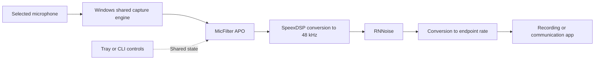

# Architecture

## Runtime

The tray is a controller. Windows loads the DLL in its audio host when a capture application uses the configured endpoint. Enabled/disabled controls live in a shared file and survive reboots. Bypass copies the original samples without inference or resampling. At 48 kHz the adapter bypasses both resamplers.

The engine supports the Windows float32 processing format, 1–8 channels and 8–192 kHz. RNNoise always receives 480-sample frames at 48 kHz. Windows callback sizes can vary. Resamplers, network state, queues and scratch buffers are initialized before processing; the callback uses fixed storage and interlocked telemetry.

## Processing details

RNNoise output is 20 ms behind its input (overlap/add plus one delayed frame); with the 10 ms frame buffer the filtered path is 1440 samples late at 48 kHz. The original (dry) signal uses the same delay so partial mixes do not comb-filter. The optional voice gate fades in over 5 ms and out over 50 ms. Around speech a -20 dB share of the original signal (`kFloorGain` in `src/dsp.h`) is mixed in so word tails never drop into digital silence. It is held while RNNoise's voice probability reaches 0.6 and for 300 ms after, then fades out over 400 ms, so pauses get RNNoise's full noise reduction. The floor only adds the original signal; the voice itself always comes from RNNoise, so its fade cannot cut a word. Reported APO latency is 30 ms plus any resampler delay.

Voice presets (`src/voice.cpp`) run after the mix at 48 kHz. Natural leaves samples untouched. Clear uses a 65 Hz high-pass, a modest 280 Hz cut, restrained 3 kHz presence and a 0.5 dB air shelf. Broadcast uses a 60 Hz high-pass, slight warmth, low-mid cleanup and restrained presence; its linked compressor uses 2:1 above -20 dBFS and +3 dB makeup. Deep uses a 40 Hz high-pass to retain low fundamentals, a +1.2 dB low shelf, a 250 Hz cut and modest 2.2 kHz presence; compression is 1.6:1 above -18 dBFS with +1.5 dB makeup. Both compressors use a 6 dB soft knee, 12 ms attack and 200 ms release. All polished presets end in a soft limiter. Changes fade out and in over 10 ms each. No pitch shifting is performed.

## Installation and upgrades

The installer embeds the application, APO, scripts, quick-start instructions and licenses. Its native Win32 wizard (`setup_ui.h`) lists `DEVICE_STATE_ACTIVE` capture endpoints with checkboxes, an optional voice choice and plain progress/completion messages. Existing MicFilter inputs are preselected; unrelated effects are marked unavailable. The selection is passed as repeated, validated `--endpoint` arguments through elevation, then as a validated GUID list to the batch transaction. CLI use with one or repeated `--endpoint` arguments is retained. Protected extraction and offline operation are unchanged.

After installation, the bootstrap executable is copied beside the application so **Add or update microphones** can reopen the same wizard offline. It is copied from the running installer into protected staging, rather than embedded recursively in its own payload. A machine-wide mutex prevents two graphical setup transactions from running together.

Registration uses one APO processing interface: `IAudioProcessingObject`. RT, configuration and system-effect interfaces remain available through COM, but are not entries in `NumAPOInterfaces`. The factory supports aggregation with a nondelegating inner IUnknown.

Only selected endpoints' effect values are changed. `installation.json` version 2 stores an array of original restore entries. The previous single-input format migrates without overwriting the original value. Reinstalling an existing input is idempotent; adding another keeps the rest. Unrelated APO slots and driver-managed chains stop installation before effects are changed; MicFilter does not replace them or wrap arbitrary third-party APOs. The audio host and interactive users can write controls and telemetry; executable directories stay protected. A uniquely matching USB media function can be restarted to rebuild the chain. Other devices may require reconnection or a reboot.

Capture verification opens each selected input explicitly and checks received frames plus that endpoint's callback/filtered-frame counters. Every APO instance retains its own DSP/resampler state, so simultaneous inputs do not share buffers. Shared voice and enable/disable controls intentionally apply to all inputs. Capture failure restores the selected batch, registration, original backups and saved controls. Capture without observed processing is pending confirmation. No audio recordings are saved.

Per-input telemetry uses `endpoints/<GUID>.bin`, with the same 64-byte layout as `state.bin` and only telemetry fields written by the APO. The endpoint property store in the documented `APOInitSystemEffects`/`APOInitSystemEffects2` initialization context supplies the GUID. Unknown initialization layouts keep global controls and audio processing but cannot confirm an endpoint; activity from another input is never substituted. The files are created and secured during installation and mapped before audio processing. See Microsoft's [initialization context](https://learn.microsoft.com/en-us/windows/win32/api/audioenginebaseapo/ns-audioenginebaseapo-apoinitsystemeffects2).

MicFilter 0.4 uses a new COM class identity to prevent cached pre-rename classes from hiding the new DLL. It recognizes the prior two class IDs during upgrade and preserves settings and the original restore backup. Runtime binaries use `%ProgramFiles%\MicFilter`. Fresh installations use `%ProgramData%\MicFilter`; an existing `%ProgramData%\WavoFilter\state.bin` is retained for compatibility if the new state file does not exist. This legacy name is storage compatibility, not microphone selection. Legacy tray windows, startup entries and the old desktop shortcut are handled during upgrade.

Each installed APO is a hash-named copy (`MicFilterAPO-<hash>.dll`) so audiodg.exe never has a loaded DLL overwritten. After a confirmed install, setup deletes the other copies, along with the WavoFilter program folder and class registrations once no endpoint references them. A file Windows audio still holds is queued with `MoveFileEx(MOVEFILE_DELAY_UNTIL_REBOOT)`.

## Uninstall

Setup registers `HKLM\...\Uninstall\MicFilter`, whose `UninstallString` is `MicFilter.exe --uninstall`. That command, or **Uninstall MicFilter** in the tray menu, starts `install.ps1 -Action Uninstall` elevated and exits. The script waits for that process, closes any tray instance, then:

1. restores the effect slot on every capture endpoint that holds a MicFilter or WavoFilter class, using its original backup and clearing the slot only when no backup exists. Disconnected endpoints keep their registry keys, so they are restored too;
2. removes the COM/APO registrations (current and legacy) and the Settings > Apps entry, and restarts the matching USB device;
3. removes shortcuts, startup entries and the program and data folders (current and WavoFilter), queuing held files for deletion at restart.

`MicFilter.exe` removes per-user data (startup entry, `%LOCALAPPDATA%\MicFilter`), because the elevated script may run as a different administrator. `MicFilter-Setup.exe --uninstall` runs the same script from the installer payload if the program folder is damaged. **Remove effect and restore configuration** detaches the input selected in the tray and retains shared registration and controls while another microphone is attached. Removing the last input disables the filter and unregisters the effect; application files remain.

## Shared-state ABI

Keep the magic and version fields compatible. Total size: **64 bytes**.

| Offset | Type | Field |
| ---: | --- | --- |
| 0 | int32 | Magic |
| 4 | int32 | ABI version |
| 8 | int32 | Enabled |
| 12 | int32 | Voice probability threshold, per mille |
| 16 | int32 | Gate grace blocks |
| 20 | int32 | Wet mix, per mille |
| 24 | int32 | Channels |
| 28 | int32 | Endpoint sample rate |
| 32 | int32 | Processing supported |
| 36 | int32 | Producing process ID |
| 40 | int64 | APO callbacks |
| 48 | int64 | Filtered endpoint frames |
| 56 | int64 | Last callback tick |

### Options file

Options added after this ABI was fixed live in `options.bin` (64 bytes, same folder and permissions), so an effect DLL still loaded from an earlier version keeps reading a valid `state.bin` until Windows restarts. Offsets: 0 magic `0x504F464D`, 4 version 1, 8 voice preset (0 Natural, 1 Clear, 2 Broadcast, 3 Deep); the rest is reserved and zero. A missing or invalid options file means Natural. An older loaded DLL cannot use Deep until Windows reloads it; setup reports when a restart is required.

The producer ID and recent monotonic tick distinguish current callbacks from old data. Tests replace ProgramData in their own process and create a private fixture; they must never write installed telemetry.

## Engine provenance

- Werman v1.21: `4b0a6f76fc8bcfb5a3603ae2cb6619dfcb0e19f2`.
- Bundled RNNoise: `70f1d256acd4b34a572f999a05c87bf00b67730d`.
- SpeexDSP 1.2.1: `1b28a0f61bc31162979e1f26f3981fc3637095c8`, standalone float resampler with `RANDOM_PREFIX=micfilter`.
- APO interface declarations are written for this project in `src/apo_sdk.h` from Microsoft's public API reference; no Windows SDK headers are redistributed. Compile-time checks pin the struct layouts.
- `vendor/rnnoise` is the upstream RNNoise tree at the revision above. The unused alternative model `rnnoise_data_little.c` is omitted.

The network and weights are unchanged. No personal training or automatic model download is implemented. Engine updates should pin a reviewed revision and repeat equivalence, streaming and physical voice checks.
